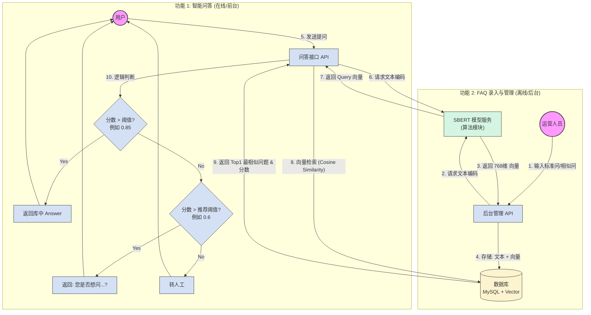

### 一、 技术方案核心说明

SBERT 的核心优势在于它通过“孪生网络”将两个句子映射到同一个向量空间，使得我们可以直接通过计算两个向量的 **余弦相似度** 来判断语义是否接近。

推荐权重：使用 SBERT 库加载 `BAAI/bge-m3` 或 `moka-ai/m3e-base`。这些模型虽然不是 SBERT 官方出的，但完全兼容 SBERT 的接口，且中文效果远超官方多语言版。

#### 核心逻辑

*   **文本编码 (Encoding)**: 输入字符串 `str` ，输出向量 `List[float]` (通常为 768 维)。
*   **相似度计算**: 使用余弦相似度公式。
    $$ \text{Similarity} = \cos(\theta) = \frac{A \cdot B}{\|A\| \|B\|} $$
    其中 A 是用户提问向量，B 是库里的标准问向量。结果范围 [-1, 1]，越接近 1 越相似。

### 二、 具体技术方案实现

作为算法开发，我们需要提供一个微服务（例如使用 FastAPI）给后端调用。这里展示核心代码。

设计一个类（FAQMatcher）封装模型加载、文本编码、相似度计算的逻辑。

模型加载：可以从Hugging Face/modelscope上下载`BAAI/bge-small-zh-v1.5` 模型到本地，用python的sentence_transformers的SentenceTransformer加载模型；`model = SentenceTransformer(r'BAAI/bge-small-zh-v1.5')`

文本编码：使用 model 的 encode 方法进行编码

相似度计算：如果FAQ记录比较少，可以直接在python中将用户的提问进行编码，并将之前存储的 FAQ 记录进行编码，调用 model 的 cos_sim 分别计算用户提问和每条FAQ记录的余弦相似度，并选出最相似的那条，判断相似度是否大于0.85，如果大于，直接返回回答；如果不大于，判断是否大于0.6，如果大于，返回“你是否想问...?”；否则，转人工。如果FAQ记录量比较大，就直接执行SQL向量查询，让数据库完成向量检索。

### 三、 工程落地架构 (Backend Integration)

在实际工程中，我们不可能每次都要把几万条FAQ记录重新算一遍向量，需要**离线存储向量，在线检索向量**。

#### 1. 数据库表结构补充

在表设计中，增加向量字段：

```sql
-- 标准问答表
CREATE TABLE faq_knowledge (
    id SERIAL PRIMARY KEY,
    category_id INT,
    question_text TEXT,
    answer TEXT,
    -- 存储 768 维向量
    embedding vector(768) 
);

-- 相似问法表
CREATE TABLE faq_similar_questions (
    id SERIAL PRIMARY KEY,
    knowledge_id INT,
    question_text TEXT,
    embedding vector(768)
);
```

#### 2. 交互流程

*   **录入/更新时**：
    1. 运营在前端输入问题。
    2. 后端调用 SBERT 服务，获取 `embedding`。
    3. 后端执行 `INSERT INTO ... (text, embedding) VALUES ('文本', '[0.12, -0.5, ...]')`。
*   **用户提问时**：
    1. 用户输入 query。
    2. 后端调用 SBERT 服务，获取 query 的 `embedding`。
    3. 后端执行 SQL 向量查询。不要在 Python 代码里循环计算相似度，这样性能比较差，将向量存入支持向量检索的数据库（Milvus/Pgvector/ES），让数据库层完成 $O(\log n)$ 级别的快速检索。

### 四、 流程图

以下是包含**数据录入**和**在线问答**两个闭环的流程图。



